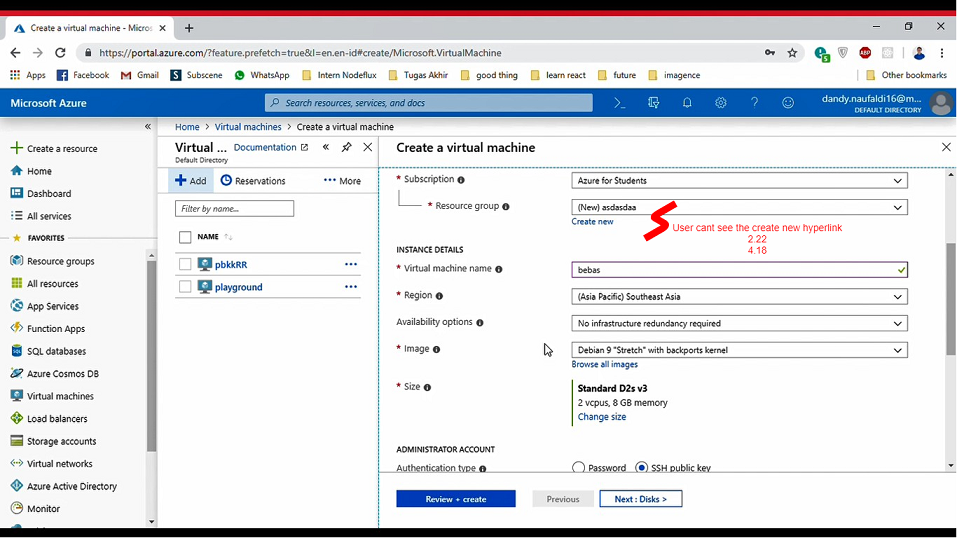
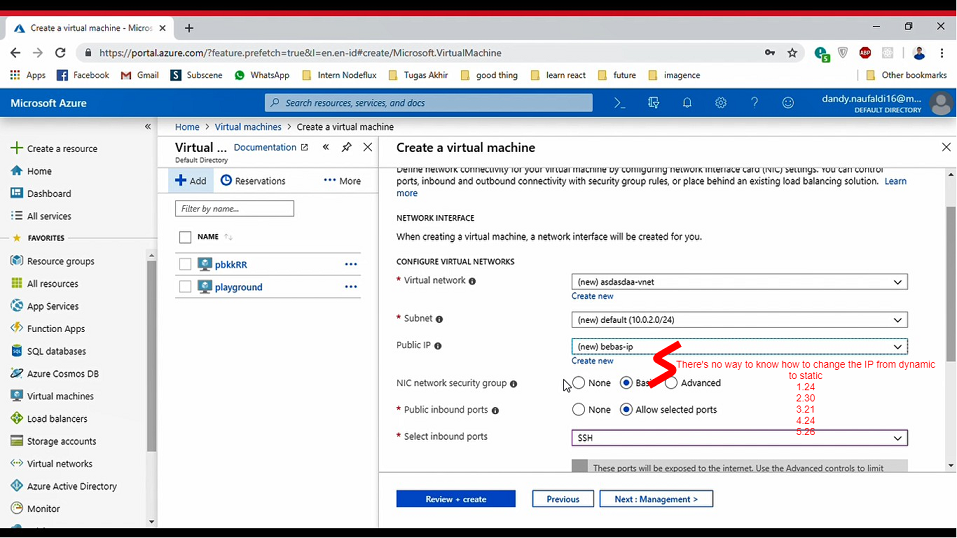
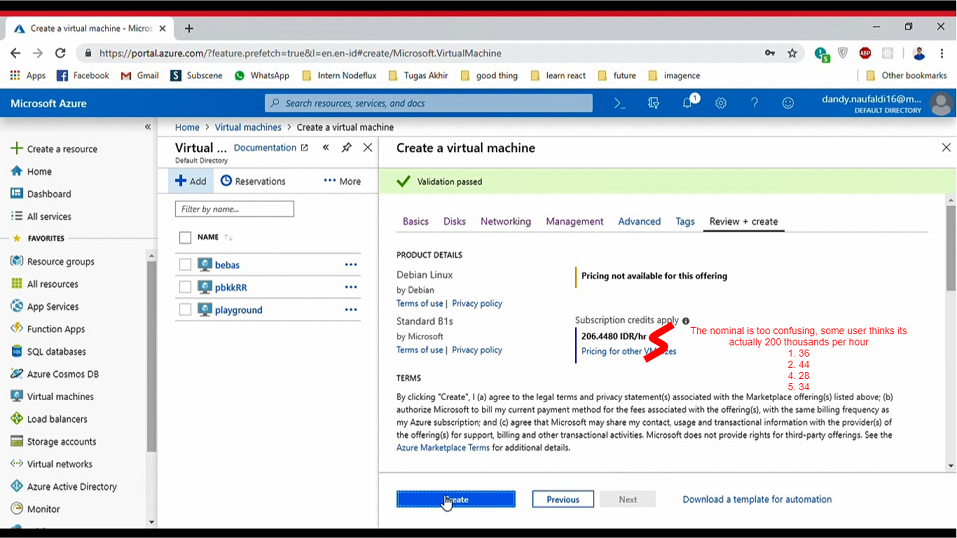
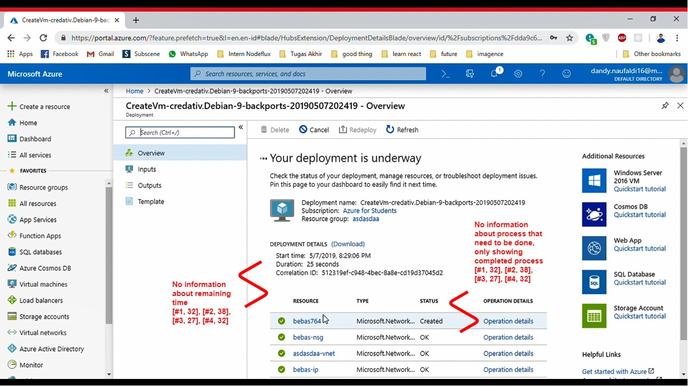
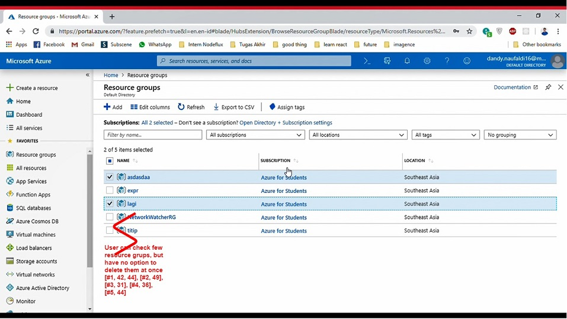
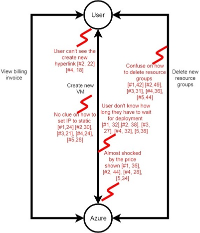
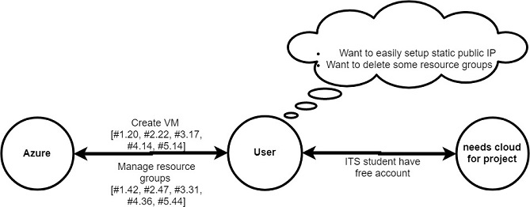

## Team member:
1. Dandy Naufaldi (05111640000011)
1. Yolanda Hertita Pratama (05111640000052)
1. Rahandi Noor Pasha (05111640000054)

## Table of Contents <!-- omit in toc -->
- [Contextual Inquiry](#contextual-inquiry)
  - [System's Description](#systems-description)
  - [System's Bad UI](#systems-bad-ui)
  - [Preliminary Question and Instruction Script](#preliminary-question-and-instruction-script)
    - [Preliminary Question](#preliminary-question)
    - [Instruction Script](#instruction-script)
  - [User Description](#user-description)
    - [Participant 1](#participant-1)
    - [Participant 2](#participant-2)
    - [Participant 3](#participant-3)
    - [Participant 4](#participant-4)
    - [Participant 5](#participant-5)
  - [Transcript](#transcript)
    - [Participant 1](#participant-1-1)
    - [Participant 2](#participant-2-1)
    - [Participant 4](#participant-4-1)
    - [Participant 5](#participant-5-1)
  - [Models and Annotations](#models-and-annotations)
    - [Artifact Model](#artifact-model)
    - [Flow Model](#flow-model)
    - [Cultural Model](#cultural-model)
  - [Do's and Don't's](#dos-and-donts)
    - [Do's](#dos)
    - [Dont's](#donts)
- [Skteching and Prototyping](#skteching-and-prototyping)
  - [Part A Sketches](#part-a-sketches)
    - [Design Rationale](#design-rationale)
  - [Part B Assumptions](#part-b-assumptions)
    - [Hardware](#hardware)
    - [Users](#users)
  - [Part C Prototypes](#part-c-prototypes)
- [Usability Evaluation and Prototyping (again)](#usability-evaluation-and-prototyping-again)
  - [Operating the Prototype](#operating-the-prototype)
  - [Part A: Usability Evaluation](#part-a-usability-evaluation)
    - [1. Brief Description of Participants](#1-brief-description-of-participants)
      - [a. Description of Participant 1](#a-description-of-participant-1)
      - [b. Description of Participant 2](#b-description-of-participant-2)
      - [c. Description of Participant 3](#c-description-of-participant-3)
      - [d. Description of Participant 4](#d-description-of-participant-4)
      - [e. Description of Participant 5](#e-description-of-participant-5)
    - [2. Evaluation Script](#2-evaluation-script)
      - [Preliminary Question](#preliminary-question-1)
      - [Instruction Script](#instruction-script-1)
    - [3. Transcript](#3-transcript)
      - [a. Transcript with Participant 1](#a-transcript-with-participant-1)
      - [b. Transcript with Participant 2](#b-transcript-with-participant-2)
      - [c. Transcript with Participant 3](#c-transcript-with-participant-3)
      - [d. Transcript with Participant 4](#d-transcript-with-participant-4)
      - [e. Transcript with Participant 5](#e-transcript-with-participant-5)
    - [4. Feedback and Incidence Analysis](#4-feedback-and-incidence-analysis)
      - [OBSERVATION 1](#observation-1)
  - [Part B: Prototyping (again)](#part-b-prototyping-again)
    - [Design Rationale](#design-rationale-1)
    - [High-Fidelity Interactive-Prototype](#high-fidelity-interactive-prototype)
    - [Application Mockup](#application-mockup)

# Contextual Inquiry
## System's Description
#### [Back to Table of Contents](#table-of-contents-) <!-- omit in toc -->

Microsoft Azure is a public cloud computing platform. It provides a range of cloud services, including full virtual machines, databases, file storage, backups, and services for mobile and web apps.

The pricing of Azure is also simpler and cost-effective. Popularly termed as “Pay As You Go”, which means how much you use, pay only for that.

link: [portal.azure.com](https://portal.azure.com)

## System's Bad UI
#### [Back to Table of Contents](#table-of-contents-) <!-- omit in toc -->
- No short way to quickly access invoice
- Confusing options on creating new virtual machine resource
- The progress shown by Azure only list the completed steps, no information about remaining steps that need to be done. The progress shown is not informative
- When creating resource from a specific resource group, we still need to specify the resource group in the form
- No options to remove several resource group at once (no option to remove them after checking all of the resource groups)

## Preliminary Question and Instruction Script
#### [Back to Table of Contents](#table-of-contents-) <!-- omit in toc -->
### Preliminary Question
- Have you ever heard of cloud technology? Like Azure, AWS ?
- Have you ever used Azure before?
- Are you familiar with accessing remote server?
- Have you ever created or used virtual machine on the cloud before?

### Instruction Script
- open Azure Portal web
- login with ITS email account
- view the billing invoice
- create a Virtual Machine with the following specs:
type B1s, area Asia South East, allow port 22, use static IP, use a new resource group, use premium SSD, use username and password
- check on list of resource groups
- delete the newly created resource group

## User Description
#### [Back to Table of Contents](#table-of-contents-) <!-- omit in toc -->
### Participant 1
- The participant is a 20 years old Male user
- Student of Informatics Department ITS
- He is familiar with cloud technology
- He had no experience with Azure
- He is not familiar with accessing remote server
- Never create or use Virtual Machine on the cloud

### Participant 2
- The participant is a 20 years old Male user
- Student of Informatics Department ITS
- He is familiar with cloud technology, usually use Digital Ocean
- He had no experience with Azure
- He is familiar with accessing remote server
- Never create or use Virtual Machine on the cloud

### Participant 3
- The participant is a 21 years old Male user
- Student of Informatics Department ITS
- He is familiar with cloud technology, usually use Google Cloud Platform
- He used Azure once, but confused and frustated with Azure 
- He is not familiar with accessing remote server
- Ever create and use Virtual Machine on the cloud

### Participant 4
- The participant is a 20 years old Female user
- Student of Informatics Department ITS
- She is familiar with cloud technology
- She had no experience with Azure
- She is not familiar with accessing remote server
- Never create or use Virtual Machine on the cloud

### Participant 5
- The participant is a 20 years old Male user
- Student of Informatics Department ITS
- He is not familiar with cloud technology
- He had no experiance with Azure 
- He is familiar with accessing remote server
- Never create and use Virtual Machine on the cloud

## Transcript
### Participant 1
#### [Back to Table of Contents](#table-of-contents-) <!-- omit in toc -->
👨‍🔬 : Miaw Member  
👨‍💻 : Participant

 1. **00:01** 👨‍🔬: Halo, nah disini kita mau melakukan Contextual Inquiry buat IMK
 1. **00:04** 👨‍💻: Oke
 1. **00:06** 👨‍🔬: Sebelumnya kita mulai dari pertanyaan permulaan dulu. Pernah denger tentang teknologi cloud, kaya AWS atau Azure, dan sejenisnya?
 1. **00:12** 👨‍💻: Pernah
 1. **00:13** 👨‍🔬: Kalau pakai Azure pernah ngga?
 1. **00:15** 👨‍💻: Ngga pernah
 1. **00:16** 👨‍🔬: Familiar ngga sama ngakses remote server? 
 1. **00:19** 👨‍💻: Tidak
 1. **00:21** 👨‍🔬: Pernah bikin atau make VM (Virtual Machine) di cloud? 
 1. **00:26** 👨‍💻: Tidak 
 1. **00:27** 👨‍🔬: Oke, kalau gitu sekarang coba kamu buka portal Azure terus login pakai email ITS.
 1. **00:36** 👨‍💻: Oke (Participant melakukan login)
 1. **03:07** 👨‍🔬: Nah, ini kan udah buka web nya Azure, sekarang coba kamu cari tampilannya buat Invoice 
 1. **03:13** 👨‍💻: (Participant menuju halaman Cost Management dan Billing, kemudian menuju bagian Invoice tetapi belum sampai menampilkan Invoice pembayaran) Apakah ini invoice?
 1. **03:27** 👨‍🔬: Belum sampe
 1. **03:29** 👨‍💻: Invoice. (Participant menekan tombol dropdown kemudian memilih akun, kemudian muncul tampilan Invoice pembayaran) ini?
 1. **03:46** 👨‍🔬: Iya itu invoice. Nah berikutnya, coba kamu bikin VM 
 1. **04:01** 👨‍💻: (Participant menuju halaman Virtual Machines kemudian menekan button Add untuk membuat VM baru)
 1. **04:32** 👨‍🔬: Nah ini kamu bikin VM tu kamu coba gunakan resource groupnya baru, speknya namanya B1S, areanya Asia Tenggara, aktifkan port buat SSH, silahkan setting username sama password terserah kamu, terus yang terakhir IP nya statis.
 1. **05:28** 👨‍💻: Oke mari kita buat. (Participant membuat VM baru dengan spek yang telah diinstruksikan) Tipenya B1S.. Lho, mahalnya. (setelah mengisi semua field form halaman Basics) Terus apalagi?
 1. **07:15** 👨‍🔬: IP nya tidak berubah, static. 
 1. **07:21** 👨‍💻: (Participant kebingungan berulang-ulang menekan tab networking, basics, disk, management dan masih kebingungan) (**09:06**) Harusnya disini (di tab networking, tapi masih belum menemukan cara untuk mengubah IP secara static) (**10:16**) Ini ngga ada menyerah? wkwkwk
 1. **10:19** 👨‍🔬: Hehe, terserah kamu.
 1. **10:22** 👨‍💻: Harusnya di tab sini (tab networking) (Participant masih berusaha mencari-cari, sampai akhirnya (**11:02**) menemukan cara untuk mengatur IP dengan create new pada public IP kemudian keluar navigasi untuk membuat IP menjadi static) 
 1. **11:20** 👨‍🔬: Yeeee. Oke.. nanti bikin lagi
 1. **11:42** 👨‍💻: Siap. Terus? Apa ini? (setelah user menekan create VM)
 1. **11:47** 👨‍🔬: Iya menurutmu ini dia menampilkan apa? 
 1. **11:50** 👨‍💻: Progress bahwa VM nya di deploy. Nah 
 1. **12:06** 👨‍🔬: Itu kok banyak tapi munculnya?
 1. **12:16** 👨‍💻: Confignya. Nah. 
 1. **12:18** 👨‍🔬: Menurutmu itu dia harus berapa lama lagi menampilkan hasilnya? 
 1. **12:24** 👨‍💻: Hmmm ngga tahu.
 1. **12:26** 👨‍🔬: Ngga tahu ya. (menunggu VM berhasil dibuat)
 1. **13:28** 👨‍💻: Nah udah
 1. **13:30** 👨‍🔬: Nah, sekarang coba kamu bikin kaya tadi satu lagi.
 1. **13:33** 👨‍💻: (Participant membuat VM baru dengan config yang sama dengan lancar) Wuuuu, omg. Kok bisa segini harganya (Participant shock dengan tampilan harga, sebenarnya hanya 1900, murah tetapi Participant tetap shock)
 1. **15:44** 👨‍🔬: Eh kok naik ya harganya dari yang tadi 200? Ooh itu ke reset tadi waktu milih tipenya. (Padahal participant sudah mengubah menjadi B1S) Btw itu tadi cuma 1900, bukan 1,9 juta.
 1. **16:22** 👨‍💻: Oke sudah ni
 1. **16:24** 👨‍🔬: Belum sek sabar masih bikin
 1. **16:28** 👨‍💻: Tak tinggal minum bisa ngga? 
 1. **16:33** 👨‍🔬: Oke silahkan (masih menunggu VM berhasil dibuat) (**17:59**) Nah tadi itu kan kamu waktu bikin VM kamu bikin resource grup baru, nah, 2 resource grup yang baru kamu buat tadi coba kamu hapus.
 1. **19:20** 👨‍💻: Resource group? (User kebingungan mencari halaman resource group di section sebelah kiri, setelah scroll section di sebelah kiri) Naaah akhirnya. (user menuju halaman resource group kemudian mencentang 2 resource group ) Nah sekarang deletenya ini dimana (user kebingungan menghapus, berulang kali mencentang, klik klik, klik kanan) 
 1. **23:11** 👨‍🔬: (Baru mnyadari kalau resource yang dicentang lebih dari 2,button dropdown nya hilang, dan kalau dicentang 1 kemudian diklik kanan, muncul tombol delete) 
 1. **23:14** 👨‍💻: Waah ini apa-apaan, satu-satu aja dah ya
 1. **23:20** 👨‍🔬: Yawes.
 1. **23:23** 👨‍💻: (Participant menghapus satu per satu pada akhirnya dan berhasil menghapus kedua resource group yang baru dibuat)
 1. **24:02** 👨‍🔬: Yeee akhirnya. Sudah nih, makasih yaaaa.
 1. **24:04** 👨‍💻: Oke sama sama, semangat!

### Participant 2
#### [Back to Table of Contents](#table-of-contents-) <!-- omit in toc -->
👨‍🔬 : Miaw Member  
👨‍💻 : Participant

 1. **00:01** 👨‍🔬: Haai, ada waktu buat kita wawancara buat tugas IMK ngga?
 1. **00:04** 👨‍💻: Oohh boleh-boleh
 1. **00:06** 👨‍🔬: Terimakasi, nah, pernah denger teknologi cloud ngga kaya Azure atau AWS?
 1. **00:11** 👨‍💻: Ee VPS? (👨‍🔬: Iya) Pernah
 1. **00:13** 👨‍🔬: Pernah makenya apa?
 1. **00:15** 👨‍💻: Digital Ocean
 1. **00:17** 👨‍🔬: Ooh DO. Pernah pake Azure ngga?
 1. **00:20** 👨‍💻: Ngga pernah 
 1. **00:21** 👨‍🔬: Oo belum pernah ya. Familiar ngga sama mengakses remote server?
 1. **00:25** 👨‍💻: SSH? Familiar
 1. **00:27** 👨‍🔬: Terus pernah bikin atau make VM di cloud?
 1. **00:33** 👨‍💻: VM? Ngga
 1. **00:36** 👨‍🔬: Pernah bikin atau make VPS di cloud?
 1. **00:38** 👨‍💻: VPS? Pernah
 1. **00:40** 👨‍🔬: Nah, oke Jadi ini tuh portal buat Azure. Azure itu menyediakan teknologi cloud juga kaya DO (Digital Ocean). Sekarang kita minta tolong kamu buat buka Invoice. 
 1. **01:15** 👨‍💻: Invoice.. hmmm nandi (Menemukan halaman Cost Management and Billing kemudian menekan button Invoice tapi belum sampai menampilkan "Invoice") ini invoice
 1. **01:37** 👨‍🔬: Ee belum sampe
 1. **01:39** 👨‍💻: (Menekan button dropdown pada Subscription kemudian memilih subscription yang ada kemudian tampil invoicenya) ini ya, udah 
 1. **01:57** 👨‍🔬: Oke. Nah terus abis ini kita bakal bikin dua VM, sekarang coba kamu menuju halaman buat bikin VM
 1. **02:15** 👨‍💻: (Menuju halaman VM) Virtual Machine, ini
 1. **02:18** 👨‍🔬: Nah iya sekarang tambah VM baru, terus sekarang kamu bikin VM dengan spesifikasi sebagai berikut, tipenya B1S, areanya di SouthEast Asia, nah itu dulu. Oh iya, kalau bikin VM nya gunakan resource group yang baru.
 1. **02:50** 👨‍💻: (Participant membuat VM baru dengan spek yang dijelaskan, ) resource group baru? gimana (Participant bingung saat mencari tempat untuk mendefinisikan resource group baru sampai akhirnya menemukan field untuk create new resource group) oalah ini, ya Allah ga ketok lho, bro bro. Terus apa lagi
 1. **03:40** 👨‍🔬: Namanya bebas, pastikan dia bisa diakses lewat SSH. Terus tipenya B1S. 
 1. **04:02** 👨‍💻: Wes.
 1. **04:04** 👨‍🔬: Terus username passwordnya bebas
 1. **04:07** 👨‍💻: (Participant cukup memakan waktu disini karena password yang digunakan harus panjang dan mengandung karakter-karakter)
 1. **05:26** 👨‍🔬: Terus aktifkan port pada SSH. Abis itu pastikan dia IP nya di set public sama static.
 1. **05:50** 👨‍💻: Jek neng kene? Opo next?
 1. **05:53** 👨‍🔬: Yo terserah. Cobak en dulu ae.
 1. **05:57** 👨‍💻: (Participant kebingungan mencari cara untuk mengganti IP menjadi public dan static) (**06:59**) Wes ga eroh (Participant menyerah kemudian langsung membuat VM tersebut)
 1. **07:12** 👨‍🔬: Udah nih? Ya nanti kita kasih tau cara nya waktu bikin VM kedua
 1. **07:16** 👨‍💻: Lho bikin lagi?
 1. **07:18** 👨‍🔬: Iya. Nah ini menurutmu tampilan apa ini? (Tampilan sedang membuat VM) 
 1. **07:28** 👨‍💻: Bikin VM.
 1. **07:32** 👨‍🔬: Kenapa itu ada banyak tadi kan cuma bikin 1?
 1. **07:45** 👨‍💻: Wah ga eroh.
 1. **07:48** 👨‍🔬: Nah dia kan lagi nyetting. Kalau kamu lihat ini tuh kira kira butuh berapa lama lagi?
 1. **07:58** 👨‍💻: Ooh, gabisa dikira-kira kayanya.
 1. **08:26** 👨‍🔬: Yadah, ini langsung bikin VM lagi kaya tadi ya
 1. **08:29** 👨‍💻: He em. (Participant membuat VM dengan spek yang sama)
 1. **10:16** 👨‍🔬: Coba tadi buka yang networking lagi. Nah disitu kan ada public IP kan, nah disitu bisa diganti jadi static sekarang.
 1. **10:42** 👨‍💻: Hoooo (Participant mengubah dynamic IP menjadi static IP)
 1. **10:57** 👨‍🔬: Nah sudah kan, itu menurutmu harganya berapa?
 1. **11:00** 👨‍💻: Seratus enam .. ribu. Eh seratus enam rupiah per jam. 
 1. **11:13** 👨‍🔬: Iya di create aja. Nah ini agak sabar nunggu ini sampai selesai.
 1. **11:32** 👨‍🔬: Nah tadi kan waktu kamu bikin VM itu kamu bikin resource grup baru, Resource group itu bisa ngelompokkan VM, storage, network IP. Kan kamu udah bikin dua. Sekarang coba kamu hapus kedua resource group yang baru kamu bikin itu. 
 1. **13:57** 👨‍💻: (Participant menuju halaman resource group kemudian langsung mengklik dropdown tanpa mencentang dan kemudian mengklik button delete (berhasil))
 1. **14:16** 👨‍🔬: Kalau kamu langsung ngehapus dua resource group secara bersamaan bisa ngga? 
 1. **14:24** 👨‍💻: Hoo (Participant mencoba menghapus kedua resource group dengan mencentang kedua resource group) ndak bisa kayanya. Terus ini buat apa ni cawang-cawang?
 1. **14:41** 👨‍🔬: Nah iya emang ngga bisa, apa guna cawang cawang ya, ngga? Yasuda hapus satu-satu aja.
 1. **15:14** 👨‍💻: (Participant menghapus resource group yang baru dibuat) Wes
 1. **15:22** 👨‍🔬: Wes, yauda gitu aja. Terima kasih banyak ya
 1. **15:28** 👨‍💻: Yok

 ### Participant 3
 #### [Back to Table of Contents](#table-of-contents-) <!-- omit in toc -->
👨‍🔬 : Miaw Member  
👨‍💻 : Participant

1. **00:01** 👨‍💻: Halooo test test
1. **00:11** 👨‍🔬: Hi.. disini kita mau nanya-nanya kamu tentang suatu web nih. Ee sebelumnya kamu pernah mendengar tentang cloud technology ngga?
1. **00:23** 👨‍💻: Pernah 
1. **00:25** 👨‍🔬: Pernah make ngga? 
1. **00:28** 👨‍💻: Kalau make pernah, tapi jarang. Kalau disuruh doang.
1. **00:34** 👨‍🔬: Hoo. Pernahnya make buat apa?
1. **00:37** 👨‍💻: Waktu itu buat magang, buat nge running modelnya. Pakai Google Cloud Platform 
1. **00:55** 👨‍🔬: Ooo gitu. Udah pernah make Azure belum?
1. **00:58** 👨‍💻: Waktu itu pernah nyoba, karena dibilang sama temen ada gratisan. Tapi aku bingung, karena lebih ribet, jadi ngga jadi.
1. **01:08** 👨‍🔬: Ooo oke. Kamu familiar dengan mengakses remote server ngga?
1. **01:16** 👨‍💻: Eeee, kurang familiar.
1. **01:18** 👨‍🔬: Oke. Terus kamu pernah buat Virtual Machine di cloud?
1. **01:37** 👨‍💻: Pernah. 
1. **01:40** 👨‍🔬: Nah oke, sekarang kan udah login di Azure nih. Sekarang coba kamu melihat invoice dari situ.
1. **01:47** 👨‍💻: Wah banyak banget nih tulisannya, ini cari invoice ya. (Participant menuju halaman Cost Manajement and Billing kemudian menekan button invoice dan menekan dropdown subscription kemudian memilih salah satu subscription) Ooh udah
1. **02:19** 👨‍🔬: Oooh udah. Oke lancar. Terus sekarang coba kamu bikin Virtual Machine. Kamu bikin resource group baru. Terus speknya B1S.
1. **02:52** 👨‍💻: (Participant kebingungan saat mencari spec tertentu, pada akhirnya menemukannya di "Change Size")
1. **03:39** 👨‍🔬: Terus allow port buat SSH. Sama authenticationnya pake Password
1. **03:42** 👨‍💻: (Mengallow SSH dan mengubah authentication) (**04:34**)Terus apa lagi tadi yang belum?
1. **04:45** 👨‍🔬: Ini kan defaultnya dia kan dynamic IP, coba kamu ganti pake static IP. 
1. **04:49** 👨‍💻: (Participant kebingungan untuk mengubah IP menjadi static) (**04:12**) Boleh menyerah ngga saya capek. Dimana ya? ngga ada tombol bantuan nih?
1. **05:52** 👨‍🔬: Tadi speknya berubah lagi ya, ngga B1S
1. **07:12** 👨‍💻: (Akhirnya menemukan caranya) Ohh disini. Ooohhh. Sembunyi sih. Gak bilang-bilang kalau sembunyi. Kenapa ini? (Mengubah IP menjadi static)
1. **07:46** 👨‍🔬: (Participant menuju halaman untuk mereview dan create) Itu harganya berapa?
1. **07:50** 👨‍💻: Seratus enam .. rupiah. Per jam.
1. **07:54** 👨‍🔬: Hooo bener. Sekarang tunggu sampai selesai. Menurutmu berapa lama lagi?
1. **08:40** 👨‍💻: Hmmm gaada estimation time nya ya? 
1. **09:10** 👨‍🔬: Iya, sekarang tinggal aja itu, bikin VM baru lagi. Sama kaya tadi spec nya.
1. **12:45** 👨‍💻: (Participant selesai membuat VM baru lagi) 
1. **12:46** 👨‍🔬: Sekarang hapus kedua resource group yang udah kamu bikin tadi.
1. **12:52** 👨‍💻: (Participant mencentang kedua resource group yang dibuat) lho kok gaada tombol hapusnya?
1. **12:58** 👨‍🔬: Lho iya yaapa. Gimana dong
1. **13:22** 👨‍💻: (Participant masih mencari-cari cara menghapus resource group) (**14:56**) Coba dari sini ah (Participant mencentang kedua resource group yang dibuat kemudian menekan tombol delete di keyboard)
1. **15:00** 👨‍🔬: (Kami tertawa, maap) 
1. **15:12** 👨‍💻: (Participant pada akhirnya menemukan kalau mencentang lebih dari satu, button dropdownnya hilang) Lho kalau dicawang dua hilang, jelek ini. (Kemudian participant menghapus satu-satu resource group) 
1. **15:51** 👨‍🔬: Naah sudah. Terima kasihhh ya.
1. **15:54** 👨‍💻: Oh sudah, gitu aja ya ternyata. Oke.

### Participant 4
#### [Back to Table of Contents](#table-of-contents-) <!-- omit in toc -->
👨‍🔬 : Miaw Member  
👨‍💻 : Participant

1. **00:01** 👨‍🔬: Haloooo. Disini kita akan bertanya-tanya padamu tentang suatu sistem. Nah sebelumnya ada pertanyaan pendahuluan nih. Sebelumnya kamu tahu tentang teknologi cloud ngga kaya Azure, AWS?
1. **00:35** 👨‍💻: Iya, pernah
1. **00:48** 👨‍🔬: Pernah make Azure ngga?
1. **00:51** 👨‍💻: Ngga
1. **00:53** 👨‍🔬: Terus kamu familiar sama mengakses remote server ngga?
1. **00:58** 👨‍💻: Ngga. Hmmm itu kaya team viewer bukan? Oo ngga pernah wkwk.
1. **01:25** 👨‍🔬: Pernah bikin VM (Virtual Machine) di cloud?
1. **01:28** 👨‍💻: Ngga
1. **01:30** 👨‍🔬: Okeee. Sekarang coba kamu buka billing Invoice
1. **02:20** 👨‍💻: (Participant masih mencari halaman yang kira-kira terdapat Invoice, kemudian akhirnya menuju halaman Cost Management and Billing) Mana se?Ini ta? 
1. **02:44** 👨‍🔬: Iya itu, pilih salah satu invoice
1. **02:47** 👨‍💻: (Participant memilih salah satu subscription) Ini sudah
1. **02:56** 👨‍🔬: Iya, sekarang bikin Virtual Machine baru
1. **03:02** 👨‍💻: How (Participant menuju halaman Virtual Machine, kemudian Add new VM)
1. **03:38** 👨‍🔬: Sekarang bikin resource group baru. Oh iya, apa yang kamu pikirkan selama ini, katakan saja
1. **03:43** 👨‍💻: Apa tadi, disuruh ngapain?
1. **03:46** 👨‍🔬: Bikin resource group baru
1. **04:04** 👨‍💻: Ooh bikin baru. (Participant tidak menekan button create new, langsung mengetik di list drop down jadi tidak bisa, kemudian sampai akhirnya sadar harus klik create new) Ooh create new
1. **04:45** 👨‍🔬: Terus regionnya ambil yang SouthEast Asia, terus tipe nya ganti B1S 
1. **04:48** 👨‍💻: Wait dimana? Oh size ini diganti B1S, terus?
1. **05:09** 👨‍🔬: Terus isi password terserah kamu
1. **05:13** 👨‍💻: (Participant juga mengisi password yang harus panjang)
1. **06:07** 👨‍🔬: Nah portnya buka buat SSH. Terus sekarang kan dia IP nya dynamic, bikin jadi static 
1. **06:15** 👨‍💻: (Participant mencari-cari cara untuk mengubah IP masih di halaman networking, pada akhirnya menyerah) (**07:55**) ngga tahu dimana, dimana?
1. **07:57** 👨‍🔬: Di Public IP terus create new.
1. **07:59** 👨‍💻: Oalah sudah, terus bikin nih? (Participant menekan button review & create)
1. **08:06** 👨‍🔬: Itu kira-kira harga nya berapa?
1. **08:09** 👨‍💻: Eee dua ratus enam. Kalau dari titiknya dua ratus enam ribu. Per hari.
1. **08:15** 👨‍🔬: Dua ratus enam rupiah per jam. 
1. **08:18** 👨‍💻: Oh yaa? Oalah. Oke (Participant create VM)
1. **09:41** 👨‍🔬: Ini menurutmu berapa menit lagi selesai?
1. **09:58** 👨‍💻: Tiga menit, empat menit. Eh tambah banyak, bukan itu bukan time yang tersisa. Mungkin sepuluh menit, atau kurang dari satu menit, hiyaa. Ngga tahu.
1. **10:36** 👨‍🔬: Iya emang ngga ada waktu buat itu, sekarang bikin resource group baru lagi sama kaya tadi.
1. **10:39** 👨‍💻: (Participant membuat resource baru)
1. **12:38** 👨‍🔬: Nah kan tadi kamu sudah bikin resource group baru, sekarang coba kamu hapus kedua resource group itu
1. **12:48** 👨‍💻: (Participant mencentang kedua resource group) Ngga bisa dihapus barengan ya, satu-satu aja ya (Participant menghapus satu-persatu)
1. **13:51** 👨‍🔬: Menurutmu cawang itu buat apa? 
1. **13:54** 👨‍💻: Ngga guna.
1. **14:08** 👨‍🔬: Nah udah nih, terima kasih yaa
1. **14:11** 👨‍💻: Oke de

### Participant 5
#### [Back to Table of Contents](#table-of-contents-) <!-- omit in toc -->
👨‍🔬 : Miaw Member  
👨‍💻 : Participant

1. **00:01** 👨‍🔬: Haloo. Disini kita mau tanya-tanya tentang suatu sistem nih. Langsung aja ya, kamu pernah dengar tentang teknologi cloud ngga, penyedianya kaya Azure, AWS dan teman-temannya?
1. **00:07** 👨‍💻: Saya tidak pernah mendengar semuanya 
1. **00:10** 👨‍🔬: Pernah pake Azure sebelumnya?
1. **00:12** 👨‍💻: Belum
1. **00:14** 👨‍🔬: Familiar sama akses remote server ngga? 
1. **00:17** 👨‍💻: Iya
1. **00:19** 👨‍🔬: Pernah bikin atau make VM atau VPS di cloud? 
1. **00:24** 👨‍💻: Di cloud? ga pernah 
1. **00:30** 👨‍🔬: Nah sekarang coba kamu buka invoice dari akun ku. Tagihannya, buka en coba 
1. **00:33** 👨‍💻: Hmmm dimana tagihan.. (Participant menuju halaman Cost Management and Billing dan Invoice tapi belum muncul tagihannya) iki tah?
1. **00:39** 👨‍🔬: Pokok sampe muncul list nominalnya berapa
1. **00:42** 👨‍💻: Nominalnya berapa? (Participant kebingungan karena invoicenya hilang, akhirnya menuju ke halaman Cost dan Billing lagi. Kemudian memilih salah satu subscription) (**01:27**) Iki tah? oh iki. Bener ta ini? Susah ya.
1. **01:33** 👨‍🔬: Iya. Nah terus sekarang coba bikin Virtual Machine baru.
1. **01:48** 👨‍💻: (Participant menuju halaman Virtual Machine kemudian membuat VM baru) Bikin baru
1. **02:01** 👨‍🔬: Nah coba bikinnya pake Resource Group yang baru.
1. **02:14** 👨‍💻: Iki, ooo bikin baru (Participant membuat resource group baru)
1. **02:21** 👨‍🔬: Nah terus region nya Asia Southeast 
1. **02:24** 👨‍💻: (Participant memilih region Asia Southeast), terus iki
1. **02:33** 👨‍🔬: Terus ganti tipe Virtual Machine nya B1S
1. **02:37** 👨‍💻: Tipe? Tipe apa? Ini ta? B1S ya, oke
1. **03:00** 👨‍🔬: Terus atur loginnya pakai username dan password, username passwordnnya terserah awakmu
1. **03:09** 👨‍💻: terserah awakmu. Haduh apa ini harus lowercase, uppercase, number (Participant mengatur username password) 
1. **03:42** 👨‍🔬: Terus aktifkan port buat SSH
1. **03:45** 👨‍💻: (Participant mengatur port SSH) wow, terus? 
1. **03:52** 👨‍🔬: Lanjut ke berikutnya, terus ini kan defaultnya dia dapat IP nya IP dinamis, coba ganti ke IP public nya jadi statis.
1. **04:12** 👨‍💻: Disini? apa di network? IP public nya jadi static (Participant kebingungan mencari cara mengubah IP public menjadi static) lho gak neng kene? tidak tidak (**05:48**) Endi, gaonok.
1. **06:03** 👨‍🔬: Perlu hint?
1. **06:05** 👨‍💻: Iya hint hint
1. **06:08** 👨‍🔬: Jadi public IP nya bikin baru.
1. **06:18** 👨‍💻: Hoooo gitu. Disini toh. Ngono lhooo. Wes 
1. **06:26** 👨‍🔬: Wes, sekarang dibikin. 
1. **06:30** 👨‍💻: Rong atus ewu lho, yakin a? (Dua ratus ribu lho, yakin ta?) (Participant melihat preview harga)
1. **06:34** 👨‍🔬: Oh ya? itu harga e berapa emang?
1. **06:36** 👨‍💻: Dua ratus ribu, eh dua ratus juta. Eh iki iki dua ratus rupiah yo wkwkwk. Per jam yo? dua ratus rupiah yo? 
1. **06:42** 👨‍🔬: Iyo dua ratus rupiah per jam. Nah menurutmu ini tampilan apa?
1. **06:51** 👨‍💻: Ini tampilan apa? status. Tampilan management VM nya masih dideploy.  
1. **07:02** 👨‍🔬: Nah kira-kira berapa lama lagi?
1. **07:05** 👨‍💻: Oh ini kira-kira segini (menunjuk waktu yang telah dikerjakan) Lho kok nambah? bukan ini yo 
1. **07:30** 👨‍🔬: Jadi awakmu bisa ngerti gak dia kira-kira kapan selesai? 
1. **07:38** 👨‍💻: Gak ngerti 
1. **07:45** 👨‍🔬: Yawes sekarang bikin VM baru lagi persis kaya tadi dengan resource group baru. Langkah-langkahnya sama kaya tadi. 
1. **07:49** 👨‍💻: (Participant membuat VM baru) wes jago ini 
1. **11:14** 👨‍🔬: Nah sudah ni, tadi kan kamu pas bikin VM sekalian bikin resource group baru, Nah sekarang coba resource groupnya itu hapusen dua dua nya 
1. **11:25** 👨‍💻: Haa, piye carane? Dimana? Iki (Menuju halaman resource group, kemudian mencentang dua-duanya) (**12:40**) Ga onok tombol delete i. Gak isok yo?
1. **13:06** 👨‍🔬: Gak bisa ya? yasudah hapus satu-satu ae
1. **13:10** 👨‍💻: (Participant menghapus satu per satu resource group yang baru dibuat)
1. **13:32** 👨‍🔬: Wes, ini lama. Gausah kamu tungguin gaapa. Sudah selesai kok. Suwun yo
1. **13:36** 👨‍💻: Wes ngunu? yee yawes

## Models and Annotations
### Artifact Model
#### [Back to Table of Contents](#table-of-contents-) <!-- omit in toc -->

### Flow Model
#### [Back to Table of Contents](#table-of-contents-) <!-- omit in toc -->

### Cultural Model
#### [Back to Table of Contents](#table-of-contents-) <!-- omit in toc -->

## Do's and Don't's
#### [Back to Table of Contents](#table-of-contents-) <!-- omit in toc -->
### Do's
- Add easy access option for frequently choosen option
- Move the create new button as part of the dropdown list
- Show remaining time in deployment progress page
### Dont's
- Show price with a confusing arrangement which may cause misread

# Skteching and Prototyping
## Part A Sketches
#### [Back to Table of Contents](#table-of-contents-) <!-- omit in toc -->
### Design Rationale
When doing the inquiry process, we found that users didn't get all the feedbacks and informations they need like knowing when their virtual machine deployment will be done, what kind of IP they're getting etc. Also, some components in Azure website didn't have the affordance and signifier when they should, like the `add new` functionality that is represented by a hyperlink instead of button. And the way they give user prevention from accessing dangerous feature can be way too confusing so that user may not knowing how to access that feature. 

Because all of that, we try to give user more information and feedback right ahead by giving them progress bar about deployment process to make them know how long they have to wait. We also try to use the right representation for user accessing certain feature. Last, we keep using confirmation for preventing user doing anything stupid but still let them knw where to access it.
## Part B Assumptions
#### [Back to Table of Contents](#table-of-contents-) <!-- omit in toc -->
### Hardware
- PC with minimum spec for web browsing
- Mouse and keyboard (I/O device)
- Internet conncetion
### Users
- Have IT background (familiar with IT terms)
- Familiar with cloud service providers
## Part C Prototypes
[Adobe XD](https://xd.adobe.com/view/ef328428-d4e1-44d9-51e7-a30612bffb85-9903/)

# Usability Evaluation and Prototyping (again)
## Operating the Prototype
#### [Back to Table of Contents](#table-of-contents-) <!-- omit in toc -->

## Part A: Usability Evaluation
### 1. Brief Description of Participants
#### [Back to Table of Contents](#table-of-contents-) <!-- omit in toc -->
#### a. Description of Participant 1
- The participant is 21 years old Female user
- Student of Informatics Department ITS
- She rarely use cloud technology
- She never use Azure before
#### b. Description of Participant 2
- The participant is 22 years old Female user
- Student of Informatics Department ITS
- She has used Google Cloud Platform before
#### c. Description of Participant 3
#### d. Description of Participant 4
- The participant is a 20 years old Male user
- Student of Informatics Department ITS
- He is familiar with cloud technology
- He had no experience with Azure
- He is not familiar with accessing remote server
- Never create or use Virtual Machine on the cloud
#### e. Description of Participant 5
- The participant is a 20 years old Male user
- Student of Informatics Department ITS
- He is not familiar with cloud technology
- He had no experiance with Azure 
- He is familiar with accessing remote server
- Never create and use Virtual Machine on the cloud
### 2. Evaluation Script
#### [Back to Table of Contents](#table-of-contents-) <!-- omit in toc -->
#### Preliminary Question
- Have you ever heard of cloud technology? Like Azure, AWS ?
- Have you ever used Azure before?
- Are you familiar with accessing remote server?
- Have you ever created or used virtual machine on the cloud before?

#### Instruction Script
- open Azure Portal website
- login with ITS email account
- create a Virtual Machine with the following specs:
type B1s, area Asia South East, allow port 22, use static IP, use a new resource group, use premium SSD, use username and password
- check on list of resource groups
- delete the newly created resource group
- logout from Azure Portal website

### 3. Transcript
#### a. Transcript with Participant 1
#### [Back to Table of Contents](#table-of-contents-) <!-- omit in toc -->
1. **00:02** me: halo, jadi ini perbaikan dari yang kemarin
1. **00:10** her: oke
1. **00:15** me: masih inget ga kemarin disuruh ngapain aja?
1. **00:25** her: hmmmm, cuma inget bikin virtual machine doang
1. **00:36** me: sama ngehapus resource groups
1. **00:42** her: oiya itu
1. **00:46** me: sekarang coba dibuka dulu
1. **00:58** her: oke (openning high-fidelity prototype) ga ada yang beda ya
1. **01:10** me: ya emang, sekarang lanjut bikin virtual machine aja
1. **01:22** her: (clicking "Virtual machines" from homepage and then clicking on "add" button) ini kemarin gimana?
1. **01:42** me: bikin resource group baru dulu
1. **01:52** her: ok
1. **02:02** me: terus ipnya jadiin static
1. **02:08** her: wah bagus - bagus, jadi gampang sekarang
1. **02:15** me: langsung review aja
1. **02:23** her: wah harganya sekarang gampang dibaca
1. **02:35** me: iyes, terus langsung create aja
1. **02:42** her: wow ada progress barnya sekarang
1. **02:57** me: yoi
1. **03:00** her: terus sekarang ngapain?
1. **03:06** me: sekarang langsung hapus resource group aja
1. **03:14** her: ok (clicking on "Resource group" on sidebar) ini bisa langsung hapus 2?
1. **03:28** me: coba aja
1. **03:34** her: (clicking 2 checkbox) woh bisa, mantab - mantab
1. **03:49** me: udah dihapus?
1. **03:59** her: (clicking "bin" icon) ok udah
1. **04:08** me: sip selesai, terimakasih
#### b. Transcript with Participant 2
1. **00:02** me: halo kira - kira ini perbaikan dari masukan - masukan participant yang alin
1. **00:08** her: wow, oke
1. **00:15** me: menurutmu dari sini ada yang berubah ngga?
1. **00:25** her: sepertinya tidak ada yang berubah
1. **00:31** me: benar, ok lanjut
1. **00:39** her: lah
1. **00:47** me: sekarang coba buka halaman virtual machine
1. **00:56** her: (clicking "Virtual machines" from sidebar) hmmm, masih ga ada bedanya
1. **01:08** me: sekarang coba bikin virtual machine
1. **01:16** her: oke (clicking "add" button)
1. **01:20** me: bikin resource group baru
1. **01:30** her: (clicking "resource group" dropdown) wah ini bagus "create new" nya didalem
1. **01:42** me: ok, sekarang lanjut set ipnya jadi static
1. **01:54** her: (clicking "Networking" tab) wow sekarang jadi keliatan static dynamicnya, tapi mending buat defaultnya ini Static aja jangan Dynamic soalnya biasanya orang - orang butuh Static
1. **02:25** me: oksip makasih masukannya
1. **02:33** her: terus ini langsung aja ya (clicking "review and create" and "create")
1. **02:45** me: terasa ada yang beda?
1. **02:51** her: progress bar?
1. **02:55** me: correct
1. **03:05** her: terus ngapain?
1. **03:12** me: ngehapus 2 resource group
1. **03:25** her: (clicking "Resource groups") terus (clicking 2 checkbox of resource groups)
1. **03:45** me: sekarang coba hapus
1. **03:57** her: woh sekarang bisa langsung 2 (clicking delete button) dah
1. **04:02** me: ok cukup, makasih
#### c. Transcript with Participant 3
#### d. Transcript with Participant 4
#### [Back to Table of Contents](#table-of-contents-) <!-- omit in toc -->
👨‍🔬 : Miaw Member

👨‍💻 : Participant
1. **00:02** 👨‍🔬: Hai, lagi sibuk ga?
2. **00:08** 👨‍💻: Ga, kenapa?
3. **00:12** 👨‍🔬: Mau minta tolong lagi terkait yang dulu ngetest web Azure. Habis dapet masukan, kalompokku bikin prototype. Ini mau dites lagi. 
2. **00:26** 👨‍💻: Oo yang itu. Jadi kayak gimana?
3. **00:35** 👨‍🔬: Buka di link ini (membuka link prototype adobe xd)
4. **00:46** 👨‍💻: Kayaknya masih sama (melihat home)
5. **00:57** 👨‍🔬: Kalau gitu, coba sekarang kamu bikin VM baru
6. **01:09** 👨‍💻: (klik menu Virtual Machine di sidebar) Buat baru ya.. (klik 'Add +' di bagian atas). Pilih apa aja?
7. **01:25** 👨‍🔬: Sama kayak kemarin sih, cuma ini ga semua bisa diubah-ubah. Ini coba bikin VM-nya pake resource group baru terus IP-nya dibuat statis.
8. **01:43** 👨‍💻: Oo, ini resource group ga ada 'Add new' lagi ya.. Hmm.. (coba klik dropdown resource group) Oh ini ada create new. (klik) Ga ada yang berubah ya
9. **02:12** 👨‍🔬: Iya, kitanya yang kurang asset-nya hehehe, ya udah habis ini pastikan IP-nya statis
10. **02:21** 👨‍💻: Hmm, ini (coba-coba klik) oh di connection. IP-nya kuubah jadi statis
11. **02:32** 👨‍🔬: Oke sip. Kamu lanjutkan sampai create
12. **02:41** 👨‍💻: Yoi, ini .. (klik review+create) Oh langsung ya. Create yak
13. **02:59** 👨‍🔬: Sekarang ini tampilan apa?
14. **03:06** 👨‍💻: Ini yang nunggu proses deploy itu kan ya? Agak beda ya
15. **03:20** 👨‍🔬: Iya, ditambahin progres bar
16. **03:28** 👨‍💻: Oo, boleh juga
17. **03:35** 👨‍🔬: Ok, sekarang ke resource group, kamu hapus resource group "ya" sama "ye".
18. **03:48** 👨‍💻: Ya, (buka resource group) Pilih "ya" sama "ye" ya. Delete-nya mana ini
19. **04:10** 👨‍🔬: Coba cek lagi
20. **04:17** 👨‍💻: O, ini. Kurang senada sama tombol lainnya ya
21. **04:26** 👨‍🔬: Ok, noted. Lanjutin hapusnya aja
22. **04:32** 👨‍💻: (Klik hapus) (mengisi form konfirmasi) Ok hapus ya
23. **04:44** 👨‍🔬: Sip, udah kehapus. Makasih ya
24. **04:50** 👨‍💻: yoi, masama

#### e. Transcript with Participant 5
#### [Back to Table of Contents](#table-of-contents-) <!-- omit in toc -->
👨‍🔬 : Miaw Member

👨‍💻 : Participant
1. **00:01** 👨‍🔬: Haloo, ketemu lagi ya. Aku mau minta tolong lagi nih
2. **00:06** 👨‍💻: Ya, kenapa?
3. **00:08** 👨‍🔬: Jadi, kapan hari kan udah nyoba web Azure itu. Nah, dari masukan anak-anak, kelompokku buat perbaikannya jadi prototype. Sekarang mau nge-test ke kamu.
4. **00:25** 👨‍💻: Oo, gitu. Boleh-boleh. Mana prototype-nya?
5. **00:30** 👨‍🔬: Ini linknya
6. **00:34** 👨‍💻: (Membuka website prototype) Hoo, langsung ke home ya
7. **00:55** 👨‍🔬: Iya, hehe. Sekarang kamu coba bikin Virtual Machine. 
8. **01:05** 👨‍💻: Dari VM, terus `Add` ini kan ya. Speknya kayak kemarin?
9. **01:20** 👨‍🔬: Iya, tapi ini ga semua fild bisa interaktif, hehe. Pokoknya kamu buat di resource group baru.
10. **01:30** 👨‍💻: Resource group yang ini ya, terus ... (klik add new)
11. **01:45** 👨‍🔬: Iya, terus kamu ubah IP-nya jadi static.
12. **01:53** 👨‍💻: IP itu di networking ini kan. (klik IP static) Udah. Ini langsung kelihatan ya kalau awalnya dynamic.
13. **02:15** 👨‍🔬: Iya, biar langsung tahu gitu. Habis ini, langsung create aja.
14. **02:23** 👨‍💻: OK, (klik review + create). Aku klik create ya 
15. **02:30** 👨‍🔬: Iya
16. **02:36** 👨‍💻: (melihat tampilan progres deployment) Oh, ada progres bar di atas ya.
17. **02:50** 👨‍🔬: Iya, kan kemarin katanya gatau kapan selesainya. 
18. **03:06** 👨‍💻: Terus apa lagi?
19. **03:13** 👨‍🔬: Sekarang coba buat hapus resource group.
20. **03:20** 👨‍💻: (klik resource group di side navbar) Dari resource group ini ya, terus hapus yang mana?
21. **03:33** 👨‍🔬: Hapus "ya" sama "ye".
22. **03:42** 👨‍💻: Langsung dua apa satu-satu?
23. **03:57** 👨‍🔬: Langsung dua aja 
24. **04:05** 👨‍💻: (klik checkbox) Oh, ada tombol delete-nya ya. (klik delete lalu isi form konfirmasi). Udah ya
25. **04:23** 👨‍🔬: Sip, makasih ya
26. **04:30** 👨‍💻: Iya, sama-sama

### 4. Feedback and Incidence Analysis
#### OBSERVATION 1 
 - **Reference**: 
 - **Feedback**: 
 - **Incidence**: 
 - **Reason**: 
 - **Resolution**: 

## Part B: Prototyping (again)
### Design Rationale

### High-Fidelity Interactive-Prototype

### Application Mockup